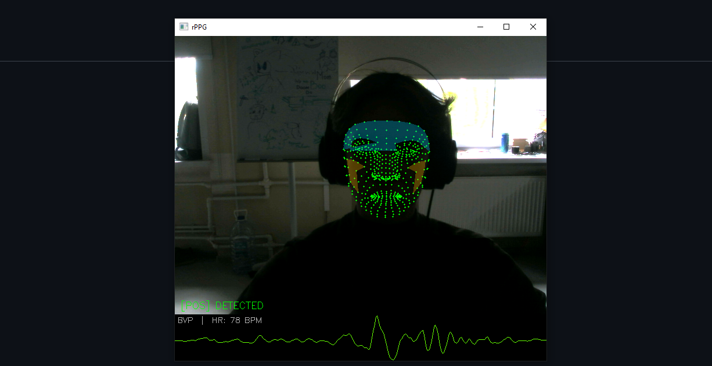

# rPPG-Detection

This project is about remote photoplethysmography (rPPG).  
It means heart rate estimation from a normal camera.  
The system looks at small color changes on the face skin.

Now the project has two parts:

- classical baseline methods: `POS` and `CHROM`
- a simple neural network on face patches: `CNN`



## What The Project Does

The project uses `MediaPipe Face Landmarker` to find the face.
After that it takes small skin patches from the forehead and cheeks.
These patches are used for:

- classical signal methods
- preprocessing for training
- a patch-based CNN model

## Project Structure

```text
rPPG-Detection/
├── main.py
├── models/
│   ├── baseline.py
│   ├── chrom.py
│   ├── loss.py
│   └── pos.py
├── src/
│   ├── config.py
│   ├── dataset.py
│   ├── face_detector.py
│   ├── preprocessing.py
│   ├── test.py
│   ├── train.py
│   ├── utils.py
│   ├── video.py
│   └── visualization.py
└── assets/
    └── me.png
```
