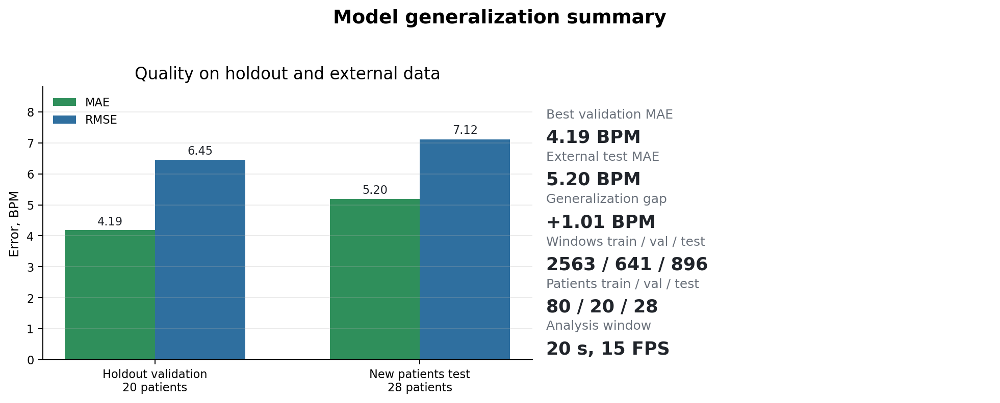
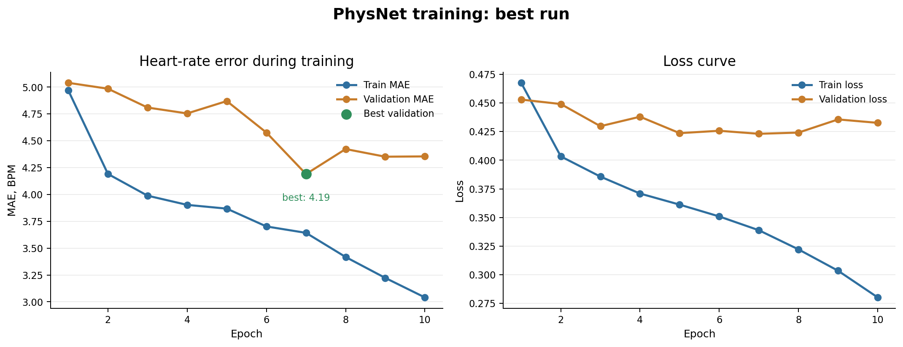
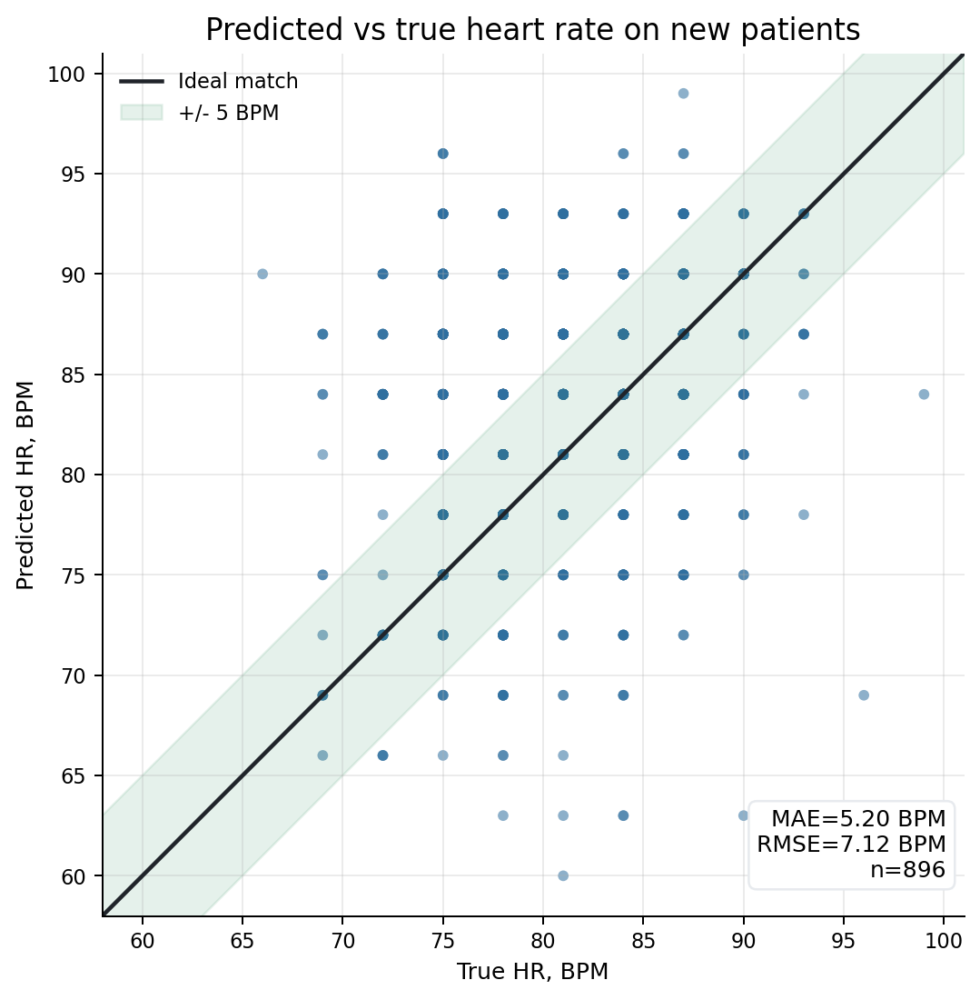
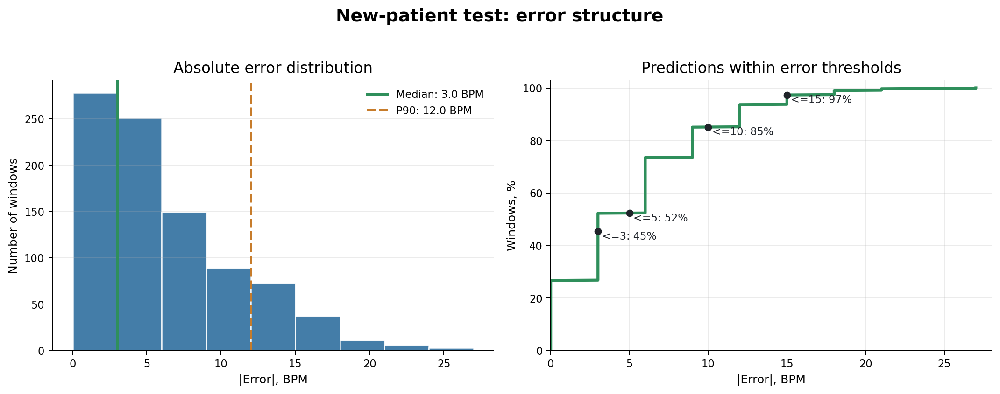
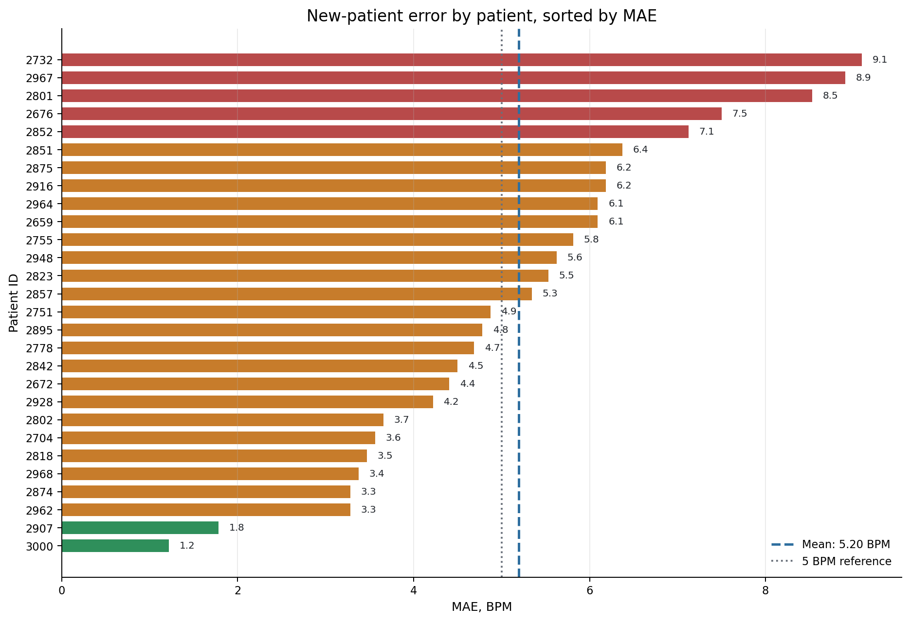

# rPPG Heart Rate Estimation

This project estimates heart rate from a face video without contact sensors.
It uses remote photoplethysmography (rPPG): a camera records small skin color
changes caused by blood flow, and the model converts them into a pulse signal.

The best current model is `PhysNet` trained with `ShiftLoss`, frame-difference
normalization, and a subject-level train/validation split.

## What The Project Does

- Finds face landmarks with MediaPipe.
- Extracts several face ROI patches from each frame.
- Builds `.npz` training windows from video and PPG signal.
- Trains `PhysNet` and baseline CNN models.
- Estimates heart rate in BPM from the predicted rPPG/BVP signal.
- Reports MAE, RMSE, scatter plots, and per-patient errors.
- Can run real-time heart-rate inference from a webcam.

## Model


PhysNet receives a sequence of face ROI patches and predicts a one-dimensional
physiological signal. Heart rate is then estimated from the strongest frequency
peak in the valid heart-rate range.

## Main Results

| Dataset | Patients | Windows | MAE, BPM | RMSE, BPM | Purpose |
|---|---:|---:|---:|---:|---|
| Holdout validation | 20 | 641 | 4.19 | 6.45 | Validation on unseen train-split patients |
| New patients test | 28 | 896 | 5.20 | 7.12 | Test on fully new patients |

The error grows by `+1.01 BPM` on new patients. This is expected: the model sees
people that were not used during training. The result is still close to the
validation quality.



## Training Result

Best training setup:

| Parameter | Value |
|---|---:|
| Model | `PhysNet` |
| Loss | `shiftloss` |
| FPS | 15 |
| Window size | 300 frames / 20 seconds |
| Train windows | 2563 |
| Validation windows | 641 |
| Train patients | 80 |
| Validation patients | 20 |
| Model parameters | 709649 |
| Best validation MAE | 4.19 BPM |



## Test On New Patients

The external test set has 28 new patients and 896 windows.

| Metric | Value |
|---|---:|
| MAE | 5.20 BPM |
| RMSE | 7.12 BPM |
| Median absolute error | 3.00 BPM |
| Std absolute error | 4.86 BPM |
| Max absolute error | 27.00 BPM |
| Mean bias, predicted - true | +1.92 BPM |

Most predictions are close to the reference heart rate, but some patients have
larger errors. This means the model is useful for a research prototype, but it
still needs more validation before medical use.





## Per-Patient Analysis

The model quality is different for different people.

- Best patient: `3000`, `MAE = 1.22 BPM`.
- Hardest patient: `2732`, `MAE = 9.09 BPM`.



## How To Run

Install dependencies:

```bash
python -m venv .venv
.venv\Scripts\activate
pip install -r requirements.txt
```

Train the best configuration:

```bash
python main.py --data-dir data/mcd_rppg_windows_fs2_200v_filt --output results --epochs 15 --batch-size 4 --lr 0.0003 --num-workers 4 --model physnet --loss shiftloss --use-frame-diff --early-stopping-patience 3 --early-stopping-min-delta 0.02
```

Run real-time inference:

```bash
python -m src.test --model-path results/best/cnn.pth
```

Run the test on new patients:

```bash
python test_new_patients.py
```

## Notes

- The current results are for research and engineering evaluation.
- The model is not medically validated.
- Large errors can happen on difficult videos or difficult patients.
- More data and external validation are needed before real-world use.
